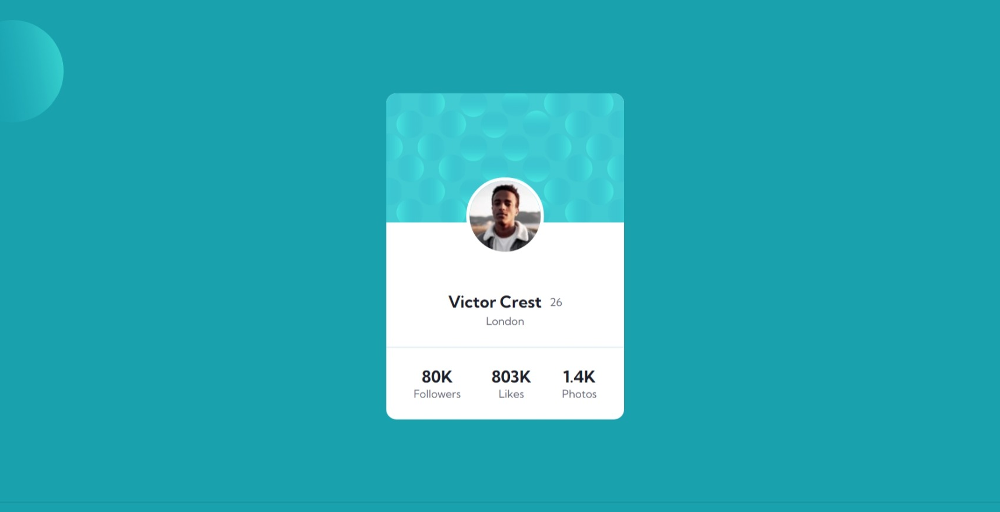

# Make It Real - Profile Card Component

This is a solution to the **Profile Card Component** project of the Make It Real course, built using React.

## Table of contents

- [Overview](#overview)
  - [The challenge](#the-challenge)
  - [Screenshot](#screenshot)
- [My process](#my-process)
  - [Built with](#built-with)
  - [What I learned](#what-i-learned)
  - [Continued development](#continued-development)
  - [Useful resources](#useful-resources)
- [Author](#author)

## Overview

### The challenge

Users should be able to:

- View the optimal layout for the site depending on their device's screen size.
- See hover states for all interactive elements on the page.

### Screenshot

#### Mobile

#### Desktop

## My process

### Built with

- **React** - A JavaScript library for building user interfaces
- **Semantic HTML5** - To structure the components effectively
- **CSS Modules** - For scoped and maintainable styles
- **Flexbox** - To manage layout and align items efficiently
- **Mobile-first workflow** - To ensure responsiveness from the ground up
- **BEM methodology** - Applied within the CSS Modules for consistent and organized class naming

### What I learned

During this project, I expanded my knowledge in React, particularly how to:

- Manage component state and props to create dynamic and reusable components.
- Utilize **CSS Modules** to keep styles encapsulated and avoid conflicts.
- Implement a **mobile-first workflow** in React projects, ensuring responsiveness across devices.
- Apply the **BEM methodology** within the context of CSS Modules to maintain organized and scalable styles.

### Continued development

In future projects, I plan to:

- Explore **React Hooks** more deeply to manage state and side effects in a cleaner way.
- Integrate **React Router** for better navigation between components.
- Enhance my understanding of **state management** in larger applications, possibly with Redux or Context API.
- Continue improving my approach to **accessibility** in React applications.

### Useful resources

- [React Documentation](https://reactjs.org/docs/getting-started.html) - The official React docs were essential in helping me understand and apply React concepts.
- [MDN Web Docs - Flexbox](https://developer.mozilla.org/en-US/docs/Web/CSS/CSS_Flexible_Box_Layout/Basic_Concepts_of_Flexbox) - This resource helped me understand the intricacies of flexbox and how to apply it effectively for responsive design.
- [BEM Methodology](http://getbem.com/introduction/) - This guide on BEM methodology was crucial for keeping my CSS modular and easy to maintain.

## Author

- GitHub - [Jaqueline Ramos](https://github.com/JaquelineRocio)
